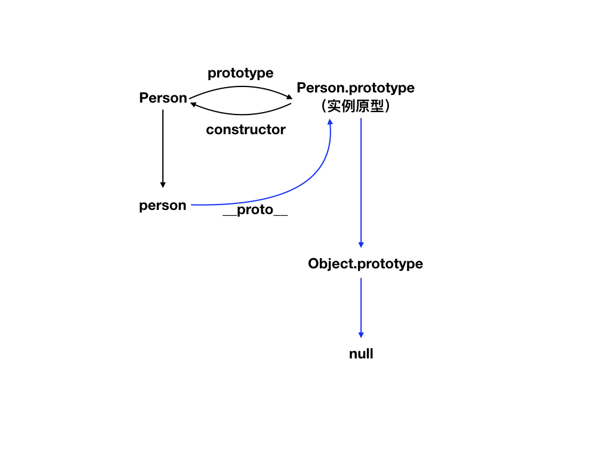

## 什么是原型？

原型是一个对象，每个 javascript 对象(非 null)在实例化的时候都会创建一个原型对象与之关联，所以原型对象上的属性均可被实例对象访问。

## 原型的初始化

一般通过构造函数的 prototype 属性就可访问到原型对象对其进行赋属性值和函数值

```js
function Person() {}
Person.prototype.name = 'jack'
Person.prototype.run = function() {
  console.log('I am run')
}
let person = new Person()
console.log(person.name) // jack
person.run() // I am run
```

## 实例对象访问原型

实例对象通过 \_\_proto\_\_ 属性访问原型对象(该属性只适用于 ie11 以上以及其他浏览器)

```js
console.log(person.__proto__ === Person.prototype) // true
```

## 原型和构造函数之间的关系

原型的 contructor 属性是指向构造函数的

```js
console.log(Person.prototype.constructor === Person) // true
```

原型的属性可被实例访问，所以以下写法也是成立的

```js
console.log(person.constructor === Person) // true
```

## 原型怎么来的

原型对象实际上是由 Object 对象实例化而来，所以默认生成的原型对象是指向 Object.prototype 的，原始 Object 对象是没有原型的，指向 null

## 原型链

实例对象的原型指向 Object 的原型，这样一种链式结构称为原型链

## 原型的作用

原型增加了一种为对象增加属性的方式，只不过原型上的属性皆为实例对象共享。在访问实例对象的属性时，先查找自身属性，找不到再去找其原型上的属性，自身原型上找不到则沿着原型链逐级往上查找

## 总结

默默看图不说话

