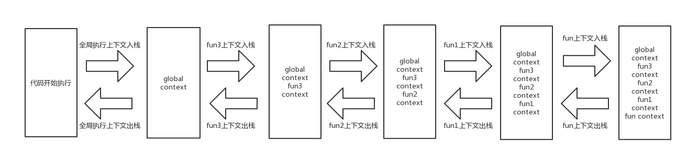

## 什么是执行上下文栈

javascript 在执行一段可执行代码过程中（从开始准备到执行结束），会创建对应的执行上下文。全局作用域有个全局上下文，函数作用域有对应函数的上下文，因为一段代码中会有很多很多函数，那这么多上下文通过什么去管理呢，于是就有了执行上下文栈。

## 执行上下文栈是怎么管理的

以下代码上下文的管理方式

```js
function fun3() {
  fun2()
}

function fun2() {
  fun1()
}

function fun1() {
  fun()
}

function fun() {
  console.log('hello world')
}
```

具体流程见下图：

